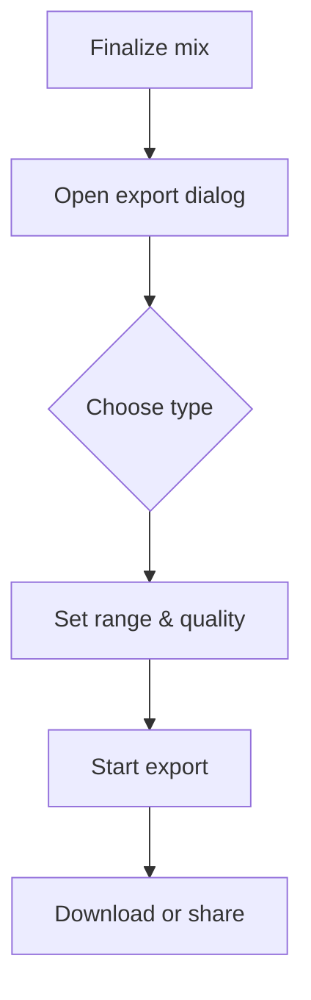

# Exporting and Sharing Workflow

Share your music outside of openDAW by rendering audio or packaging the project.

1. **Finalize your mix.** Balance tracks and stop playback where you want the export to end.
2. **Open the export dialog.** From the main menu choose _File → Export_.
3. **Pick an option.** Select _Audio Mixdown_ to render a WAV/MP3, _Stems_ for individual tracks, or _Project Bundle_ to create an `.odb` file.
4. **Set the range and quality.** Export the entire song or define markers, then choose sample rate and format.
5. **Start the export.** Click _Export_ and wait for processing to complete.
6. **Download or share.** Save the resulting file to your computer or send the bundle to a collaborator.

Use this workflow whenever you need to back up a project or deliver a finished track. For collaboration tips see the [Collaboration workflow](collaboration.md). For technical details on stem export see the [Stems Configurator](../../docs-dev/services/stems.md).
