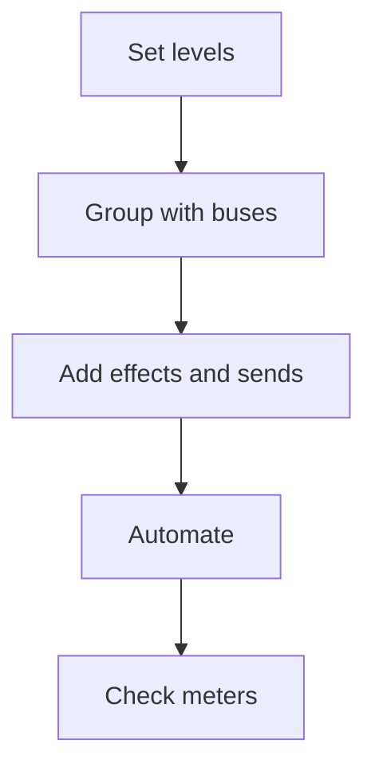

# Mixing Workflow

Balance and polish your tracks before exporting.

1. **Set initial levels.** Use mixer faders to create a rough balance between tracks.
2. **Group with buses.** Route related tracks to a bus and adjust its level.
3. **Add effects and sends.** Insert EQ, compression, or route signals to return tracks for shared effects.
4. **Automate.** Draw automation curves for volume or device parameters to add movement.
5. **Check meters.** Watch for clipping and adjust gain staging before exporting.

Continue with the [Exporting workflow](exporting.md) when the mix feels right.
