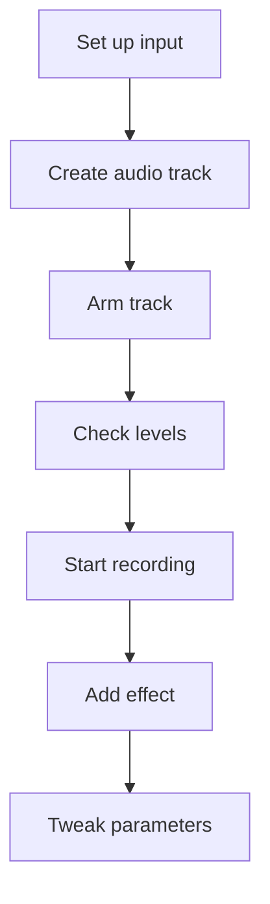

# Record and FX Workflow

Capture audio and shape it with effects.

1. **Set up your input.** Connect a microphone or instrument and allow browser audio permissions.
2. **Create an audio track.** Use the `+` button to add a track configured for audio recording.
3. **Arm the track.** Click the record icon on the track header so it lights up.
4. **Check levels.** Speak or play to confirm the meter moves without clipping.
5. **Start recording.** Press the main record button in the transport and perform your part.
6. **Stop when finished.** Hit stop to place the recorded clip on the timeline.
7. **Add an effect.** In the device panel for the track, choose an effect such as delay or reverb.
8. **Tweak parameters.** Adjust knobs or sliders to taste while listening to playback.
9. **Commit the take.** Rename the clip or consolidate it, then save the project.

With these steps you can record vocals or instruments and immediately enhance them with built‑in effects.
