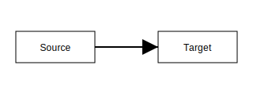

_This package is part of the openDAW SDK_

# @opendaw/lib-box

Graph-based object modeling system with serialization, transactions, and pointer management for TypeScript projects.

## API Docs

See the [API documentation](https://opendaw.org/docs/api/box/) for detailed reference.

## Graph relationships

Boxes contain fields which represent the vertices of the graph. Fields can be primitives, objects, arrays or pointers.
Pointer fields create edges to other vertices and are tracked by the graph so that updates propagate correctly.

The `PointerHub` and `GraphEdges` modules keep these connections consistent and notify listeners when relationships change.

## Synchronization

Graphs can be synchronized across contexts using `SyncSource` and `SyncTarget`. The source observes local updates and
emits `UpdateTask` messages, while the target applies incoming tasks to its own graph.

This flow keeps graphs in different threads or machines consistent while allowing transactions to batch multiple changes.

## Wishlist

* Introduce readonly fields (cannot only be written in the constructing phase)
* Introduce meta-fields (compile time only)
* Add array with all TypeMap keys

