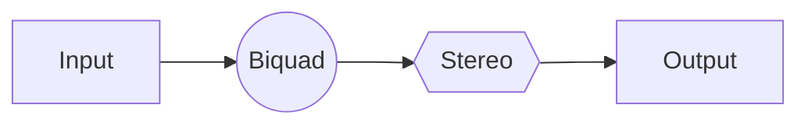

_This package is part of the openDAW SDK_

# @opendaw/lib-dsp

Digital Signal Processing utilities and audio processing functions for TypeScript projects.

## API Docs

See the [API documentation](https://opendaw.org/docs/api/dsp/) for detailed reference.

## Example

```ts
import {BandLimitedOscillator, Waveform} from "@opendaw/lib-dsp";

const osc = new BandLimitedOscillator();
const buffer = new Float32Array(128);
osc.generate(buffer, 440 / 48000, Waveform.sawtooth, 0, buffer.length);
```

For more guides and recipes see the [DSP docs](../../docs/docs-dev/dsp/).

## Signal Flow



See {@link BiquadProcessor} and {@link StereoMatrix} for the stages shown above.

## Core Audio Processing

* **[fft.ts](../../docs/docs-dev/dsp/fft.md)** - Fast Fourier Transform implementations
* **[rms.ts](../../docs/docs-dev/dsp/utilities.md#rms)** - Root Mean Square calculations
* **[delay.ts](../../docs/docs-dev/dsp/delay.md)** - Audio delay effects and processing
* **stereo.ts** - Stereo audio processing utilities ({@link StereoMatrix})
* **window.ts** - Windowing functions for signal processing ({@link Window})

## Oscillators & Synthesis

* **[osc.ts](../../docs/docs-dev/dsp/oscillators.md)** - Oscillator implementations and waveform generation
* **[value.ts](../../docs/docs-dev/dsp/utilities.md#value)** - Audio value processing and manipulation
* **ramp.ts** - Smooth parameter transitions and ramping ({@link Ramp})

## Musical Theory & MIDI

* **[notes.ts](../../docs/docs-dev/dsp/notes.md)** - Musical note utilities and conversions
* **chords.ts** - Chord theory and generation ({@link Chord})
* **midi-keys.ts** - MIDI key mapping and utilities ({@link MidiKeys})
* **fractions.ts** - Musical fraction calculations ({@link Fraction})

## Timing & Rhythm

* **ppqn.ts** - Pulses Per Quarter Note timing utilities ({@link PPQN})
* **bpm-tools.ts** - Beats Per Minute calculations and tools ({@link BPMTools})
* **[grooves.ts](../../docs/docs-dev/dsp/grooves.md)** - Rhythm and groove pattern utilities

## Audio Graph & Events

* **graph.ts** - Audio processing graph utilities ({@link Graph})
* **events.ts** - Audio event handling and scheduling ({@link EventCollection})
* **fragmentor.ts** - Audio fragment processing

## Filters & Effects

* **biquad-coeff.ts** - Biquad filter coefficient calculations ({@link BiquadCoeff})
* **biquad-processor.ts** - Biquad filter processing implementation ({@link BiquadProcessor})

## Utilities

* **[utils.ts](../../docs/docs-dev/dsp/utilities.md)** - General DSP utility functions
* **global-console.d.ts** - Global console type definitions
