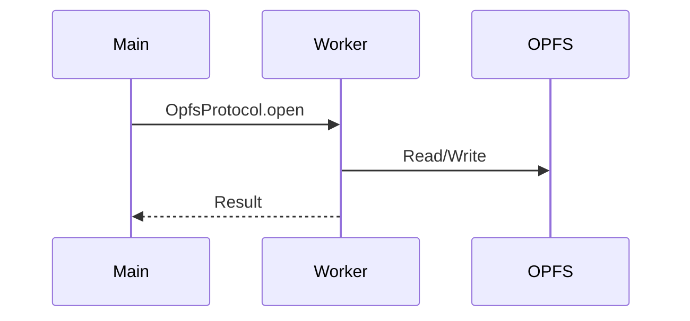
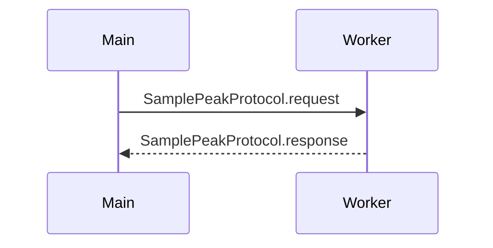
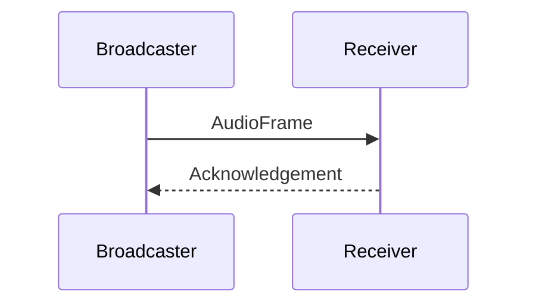

_This package is part of the openDAW SDK_

# @opendaw/lib-fusion

Web-based audio workstation fusion utilities for TypeScript projects.

## API Docs

See the [API documentation](https://opendaw.org/docs/api/fusion/) for detailed reference.

## File System Operations

* **OpfsWorker.ts** - Origin Private File System worker implementation
* **OpfsProtocol.ts** - OPFS communication protocol definitions

### Message Flow

## Audio Visualization

* **Peaks.ts** - Audio peak data management and processing
* **PeakWorker.ts** - Web Worker for peak generation
* **PeakProtocol.ts** - Peak data communication protocol
* **PeaksPainter.ts** - Canvas-based peak visualization rendering

### Message Flow

## Live Audio Streaming

* **live-stream/** - Directory containing live audio stream processing utilities

### Message Flow

## Core Types

* **types.ts** - Type definitions for fusion operations
