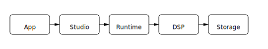

_This package is part of the openDAW SDK_

# @opendaw/lib-runtime

Runtime utilities and asynchronous operations for TypeScript projects.

The diagram shows how data moves from the App through the Studio, Runtime and DSP layers before reaching storage.

## Async & Promises

* **promises.ts** - Promise utilities and async operation helpers
* **wait.ts** - Waiting and delay utilities
* **runtime.ts** - Runtime environment utilities

## Network & Communication

* **fetch.ts** - HTTP request utilities and fetch wrappers
* **network.ts** - Network-related utilities
* **messenger.ts** - Message passing utilities
* **communicator.ts** - Inter-process communication helpers

## Time & Performance

* **timespan.ts** - Time span calculations and utilities
* **stopwatch.ts** - Performance timing and measurement utilities
