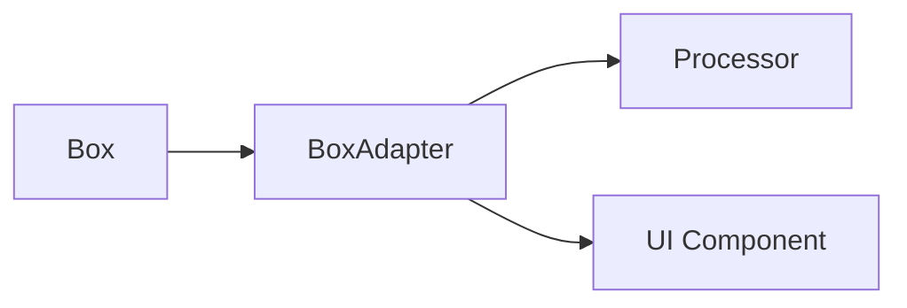
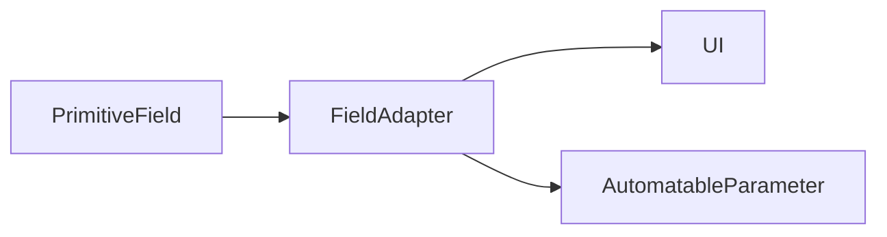
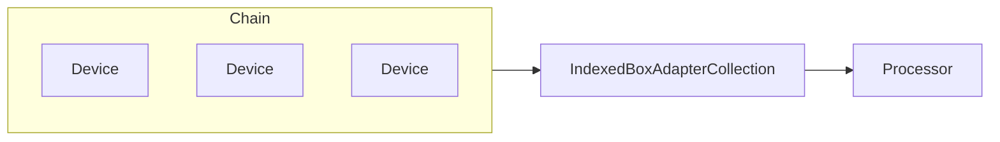

# Studio Adapters

The adapter layer forms the glue between the structured **box** data model and
audio worklet **processors**. Adapters wrap boxes exported from
`@opendaw/studio-boxes` and expose convenient TypeScript APIs for the user
interface and higher level services.

## Adapter pattern

Adapters usually follow the pattern shown below:

* A **Box** stores persistent state.
* A **BoxAdapter** translates that state into a richer API.
* A **Processor** (for example {@link @opendaw/studio-core-processors#RecordingProcessor | RecordingProcessor})
  consumes the state on the audio thread.
* UI components interact solely with adapters and remain unaware of the
  underlying storage format.

## Field adapters

The {@link FieldAdapter} and {@link AutomatableParameterFieldAdapter} classes
wrap individual {@link @opendaw/lib-box#PrimitiveField | primitive fields}.
They provide value mapping, formatting and—where applicable—automation support
via the {@link @opendaw/studio-core-processors#AutomatableParameter | AutomatableParameter}
processor.

## Collections

When multiple adapters need to be managed, collections such as
{@link IndexedBoxAdapterCollection} maintain ordering by using the
{@link IndexComparator}. This is typically employed for device chains or track
lists where the order is significant.

These patterns allow the studio to share behaviour across many different parts
of the application while keeping the underlying data structures immutable and
serialisable.

