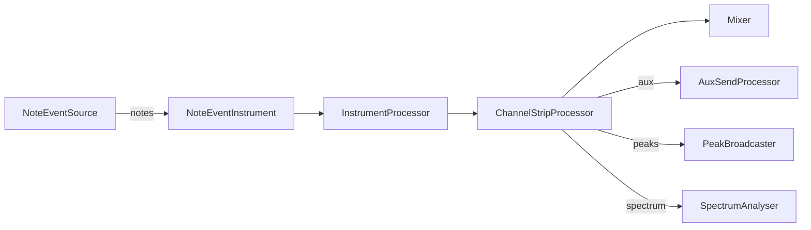

# Core Processors

This package contains the Web Audio `AudioWorkletProcessor` implementations that power the OpenDAW engine.

## Processing flow

The diagram illustrates how note events are transformed into audio, mixed, and analysed within the engine.
