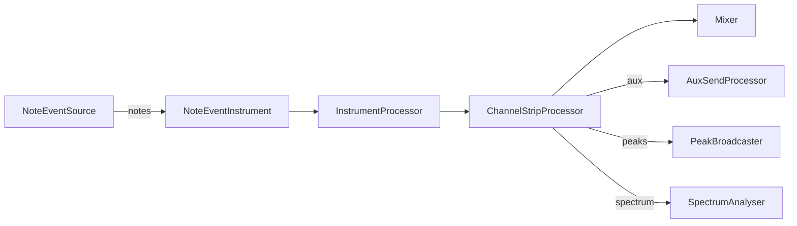

# Core Processors

This package contains the Web Audio `AudioWorkletProcessor` implementations that power the OpenDAW engine.

## Processing flow

The diagram illustrates how note events are transformed into audio, mixed, and analysed within the engine.

## Test fixtures

Processor behaviour can be verified with the example projects in [`test-files`](../../../test-files).
Additional details are documented in the [developer testing guide](../../docs/docs-dev/testing/test-files.md).
