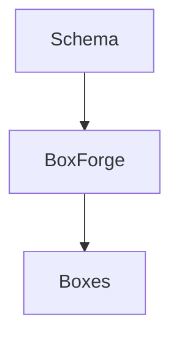

# @opendaw/studio-forge-boxes

Schemas defining Studio box structures. These declarations are consumed by
`BoxForge` to generate strongly typed classes used by the Studio runtime.

See the docs under `packages/docs/docs-dev/forge-boxes` for a full
walkthrough of the available boxes and how to extend them.
